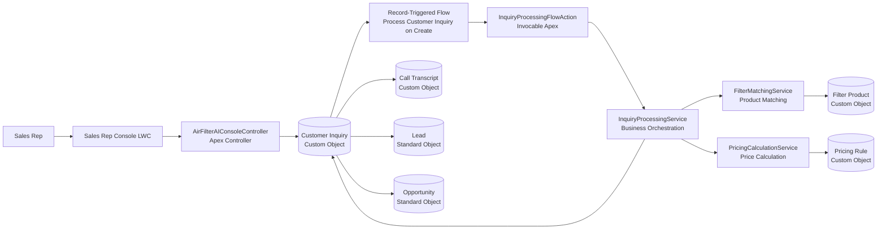

# AirFilterAI Salesforce CRM

AirFilterAI Salesforce CRM is a Salesforce-native implementation of an AI-assisted sales and customer service workflow for a custom air filter manufacturer.

The application helps sales representatives capture customer inquiries, match requested filter dimensions against a product catalog, calculate estimated pricing, and automatically process inquiries using Salesforce Flow and Apex.

## Project Purpose

This project was built as a Salesforce portfolio project to demonstrate practical CRM architecture, Apex development, Lightning Web Components, Flow automation, custom object modeling, and Salesforce DX source-driven development.

It is based on the same business problem as my original AirFilterAI capstone project and my Power Platform version, but rebuilt using Salesforce-native tools.

## Business Scenario

A custom air filter manufacturer receives customer requests through sales representatives, web forms, or future AI voice integrations. Customers ask about filter availability, pricing, lead time, and custom sizes.

The Salesforce solution supports this workflow by:

- Capturing customer inquiries
- Matching requested dimensions to standard filter products
- Calculating estimated pricing using configurable pricing rules
- Automatically updating inquiry status
- Preparing records for sales follow-up
- Storing future AI call transcripts

## Main Features

- Custom Salesforce data model for filter products, customer inquiries, pricing rules, and call transcripts
- Lightning Web Component sales console for product matching and inquiry creation
- Apex service layer for product matching and price calculation
- Record-triggered Flow for automatic inquiry processing
- Invocable Apex action for Flow integration
- Apex tests for service logic
- Salesforce DX project structure with Git source control

## Architecture Overview


## Salesforce Components

### Custom Objects
- `Filter_Product__c`
- `Customer_Inquiry__c`
- `Pricing_Rule__c`
- `Call_Transcript__c`

### Apex Classes
- `FilterMatchingService`
- `PricingCalculationService`
- `InquiryProcessingService`
- `InquiryProcessingFlowAction`
- `AirFilterAIConsoleController`
- `TestDataFactory`
- Apex test classes

### Lightning Web Components
- `airFilterSalesConsole`

### Flow
- `Process_Customer_Inquiry_On_Create`

### Screenshots
**Sales Rep Console — Product Match**


**Customer Inquiry Record**


**Data Model**


**Flow Automation**


### Development Setup

This project uses Salesforce DX.

**Authorize Dev Hub**
```bash
sf org login web --set-default-dev-hub --alias AirFilterAI-DevHub
```

**Create Scratch Org**
```bash
sf org create scratch \
  --definition-file config/project-scratch-def.json \
  --alias AirFilterAI-Scratch \
  --duration-days 30 \
  --set-default
  ```
**Deploy Source**
```bash
sf project deploy start
```
**Run Apex Tests**
```bash
sf apex run test --test-level RunLocalTests --result-format human --code-coverage
```
**Open Scratch Org**
```bash
sf org open
```
### Technical Decisions

**Why Apex Service Layer?**

The business logic is separated into service classes instead of being placed directly inside the LWC controller or Flow. This makes the logic easier to test, reuse, and extend.

**Why Flow + Invocable Apex?**

The record-triggered Flow handles Salesforce automation, while Invocable Apex performs the more complex product matching and pricing logic. This reflects a practical Salesforce implementation pattern where declarative automation and code work together.

**Why Custom Pricing Rules?**

Pricing rules are stored as Salesforce records instead of hardcoded values. This allows future business users or admins to modify pricing behavior without changing Apex code.

### Current MVP Limitations
- Product matching currently uses exact dimension matching.
- Pricing calculation supports basic quantity discount logic.
- The current processing service is suitable for MVP use, but could be further bulkified for large data imports.
- AI voice integration is represented architecturally and can be added through a future REST API endpoint.
### Future Enhancements
- Apex REST API endpoint for external AI voice platforms
- Experience Cloud customer request portal
- Lead conversion workflow
- Opportunity and quote generation
- Transcript summary and sentiment analysis
- More advanced product matching with nearest-size recommendations
- Custom Metadata Type for pricing configuration
- Permission sets and deployment automation
### Skills Demonstrated
- Salesforce data modeling
- Apex development
- SOQL and DML
- Lightning Web Components
- Record-triggered Flow
- Invocable Apex
- Apex unit testing
- Salesforce DX
- Git-based development
- CRM architecture
- Business process automation

## Lead Qualification Workflow

The MVP was extended with a sales operations workflow that automatically qualifies customer inquiries after product matching and pricing.

The qualification logic assigns a lead score based on quantity, company information, target use case, urgency, matched product availability, and contact completeness.

Based on the score, the system assigns a lead priority, recommends the next sales action, and flags whether follow-up is required.

This feature demonstrates how Salesforce can support sales operations teams by reducing manual triage and standardizing follow-up behavior.
